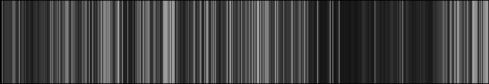
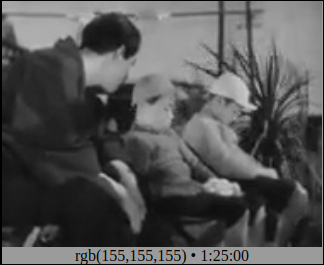
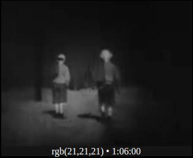
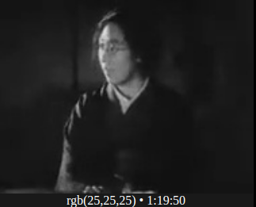

Iro writeup 1

*An interactive version of the images seen below can be accessed at https://randyzhou.com/Iro/?film=iwasbornbut*

We've discussed formal techniques such as lighting, shot scale and transitions at length so far-- both in terms of what they literally are as well as in terms of what effects they bring to a certain scene, or what themes they serve to reinforce. Of course, many if not most of the techniques don't translate well to the two-dimensional bar vizualization that comprises the bulk of our critical creative project (how do you quantify an iris transition?), but in the black and white era in particular, lighting stands out as an exception to this rule. Dramatic scenes, such as indoor scenes or those shot with low-key lighting, appear as a myriad of blacks and dark greys when transposed onto the horizontal canvas of Iro, while lighter scenes (perhaps due to high key lighting or even just a very sunny weather forecast) often appear close to white. From this, there remains much to infer about how scenes were composed and shot from such vizualizations, in spite of its inability to capture "in-the-moment" dynamism. To illustrate this, I can think of no better example than Yasujiro Ozu's 1932 film *I Was Born, But...*.

Assuming the above image remains legible (and we encourage you to actually visit the link listed above to get a higher resolution version that is not subject to image compression), one might immediately notice two things from the Iro vizualization. Firstly, the film is relatively bright for the most part-- which makes sense given that much of the film (especially in the first half) takes place outdoors on sunny mornings skipping school. Secondly, there emerges a "dark cloud" in the second half of the film that takes up effectively twenty five minutes of screentime, and includes the home screening and subsequent family turmoil. But, this cloud does make way for sunny skies yet again, and the film's final minutes are spent in relative illumination.

*A brighter still from the closing scenes, signalling that the conflict has been resolved.*

A closer inspection of these two regions (primarily light and primarily dark) reveals that they roughly correspond to instances of outdoors vs. indoors-- a revelation that might initially elicit responses of "well, duh, the sun's a lot brighter than some dingy ceiling lamps." But, I think these brightness levels are a conscious decision, and the "effect" rather than the "cause" (i.e., it is precisely because they are less emotionally heavy scenes that they are more brightly lit, rather than just because they are outdoor scenes); one could easily imagine outdoor scenes that appear dark (either due to weather or being at night). In fact, there some such shots in the film as well-- scrolling through the Iro page for *I Was Born, But...* reveals that at approximately one hour and six minutes into the film, the Yoshi brothers walk back home on a dimly lit road after witnessing their father humiliate himself on home video (the corresponding rgb value, which can be seen below, is near black and has a "brightness" level of 21/255).

*The Yoshi brothers walk home in darkness.*

As you might expect, such shots only appear in the "dark cloud" region, at the height of the film's familial drama, and as such I argue that portrayals of brightness and lighting were conscious decisions by the film crew meant to emphasize the height of emotional tension. Naturally, we associate darkness (especially when combined with high-contrast imagery from low key lighting) with conflict and uncertainty, and it should be no surprise that by the time we reach figurative stormcloud territory (in the plot), we are reaching chromatic stormcloud territory as well. In other words, by portraying the lighter-hearted stories and vignettes of the Yoshi brothers' quest for social status in cheery high-key lighting, the climactic scenes of the film stand out even more because of their darkness, emphasizing their drama.

*A dramatic, dark and high-contrast shot of the mother-- a textbook example of low-key lighting seen in the "dark cloud" phase of I Was Born, But...*

